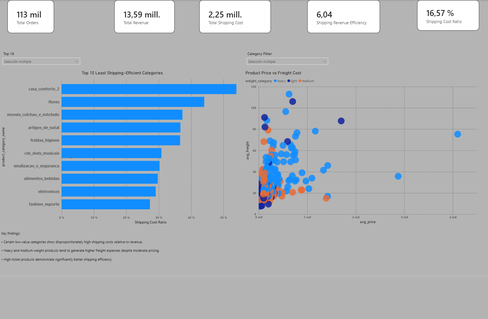
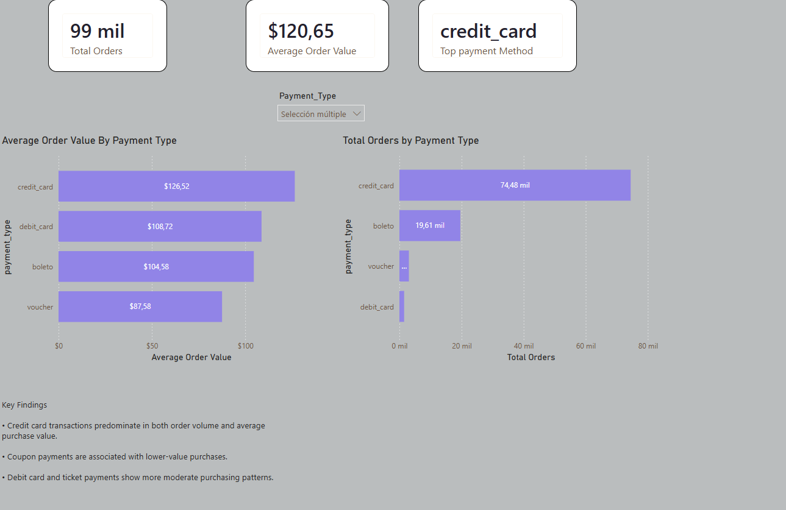

# E-Commerce Logistics & Payment Behavior Analysis

The goal of this project is to analyze transactional e-commerce data to identify logistical inefficiencies
 (unprofitable shipping fees) and customer purchasing habits (preferred payment methods),
 providing data-driven recommendations to improve profit margins and operational strategy.

The project mainly focuses on:

-Logistic efficiency

-shipping cost optimization

-payment behavior analysis

-ecommerce operational insights.

## Tools & Technologies
 
- SQL (MySQL)

- Python (Pandas, NumPy)

- Power BI

- DAX

- Google Colab

## Project Structure
```text
├── SQL/
│   ├── fact_table_creation.sql
│   ├── logistics_views.sql
│   ├── business_queries.sql
│   └── verify_duplicate_joins.sql
│
├── Python/
│   ├── payment_behavior_analysis.ipynb
│   └── Data/
│
├── PowerBI/
│   ├── logistics_efficiency.pbix
│   └── payment_behavior.pbix
│
├── images/
│   ├── logistics_dashboard.png
│   └── payment_dashboard.png
│
└── README.md
```
## SQL Data Modeling

SQL was responsible for building the analytical data model,
creating logistics-focused views,
category dimensions,
and business queries later integrated into Power BI dashboards.

## Python ETL & Payment Analysis

Python handled ETL operations,
data cleaning,
payment transformation,
and behavioral analysis preparation for the payment-focused dashboard.

## Power BI Dashboards

### Logistics Efficiency Dashboard

This dashboard evaluates shipping efficiency across product categories,
weight groups,
and freight costs.



## Key Findings

- Certain low-value categories show disproportionately high shipping costs relative to revenue.

- Heavy and medium-weight products tend to generate higher freight expenses despite moderate pricing.

- High-ticket products demonstrate significantly better shipping efficiency.

### Payment Behavior Dashboard

This dashboard analyzes customer payment behavior,
order value patterns,
and payment method usage.



## Key Findings

- Credit cards dominate both order volume and average purchase value.

- Boleto payments are widely used for mid-range purchases.

- Voucher payments are primarily associated with low-value transactions.

